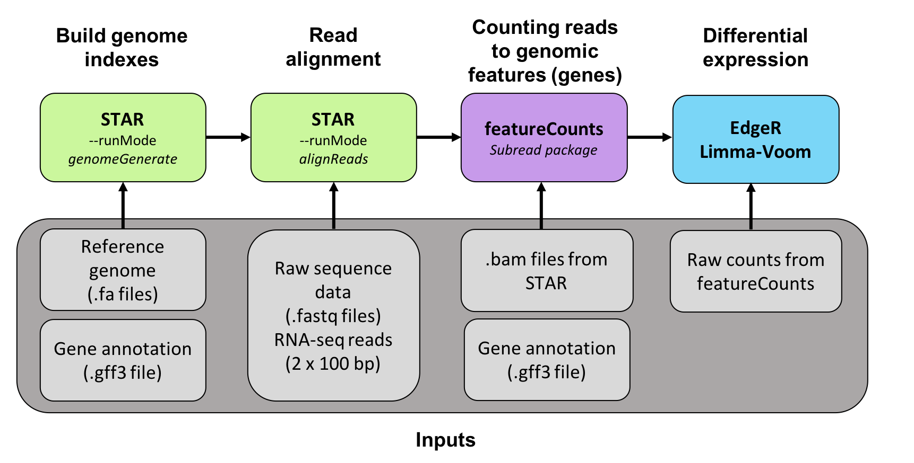

# README 
                              
The following directory contains all shell scripts necessary for the analysis of an RNAseq experiment, mainly alignment using star and de novo assembly of a viral genome using Trinity and SPAdes. 

Feature counts was used to count reads mapped to the genome, and the raw counts were later using in the Limma-voom pipeline for differential expression analysis. This is contained in the Differential expression directory. 

Directory structure: 

/Scripts 

The scripts directory contains all the scripts to perform the alignment of raw reads from an RNAseq experiment. The pipeline used in this analysis is presented in the following imaged. Some scripts in the scripts directory were not used in this pipeline. 




